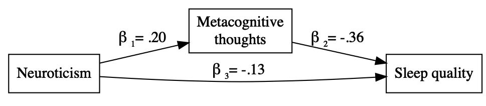

# My_project_example

Version 0.1.0

Example of a correct project workflow


## Project organization

```
.
├── .gitignore
├── CITATION.md
├── LICENSE.md
├── README.md
├── requirements.txt
├── bin                <- Compiled and external code, ignored by git (PG)
│   └── external       <- Any external source code, ignored by git (RO)
├── config             <- Configuration files (HW)
├── data               <- All project data, ignored by git
│   ├── processed      <- The final, canonical data sets for modeling. (PG)
│   ├── raw            <- The original, immutable data dump. (RO)
│   └── temp           <- Intermediate data that has been transformed. (PG)
├── docs               <- Documentation notebook for users (HW)
│   ├── manuscript     <- Manuscript source, e.g., LaTeX, Markdown, etc. (HW)
│   └── reports        <- Other project reports and notebooks (e.g. Jupyter, .Rmd) (HW)
├── results
│   ├── figures        <- Figures for the manuscript or reports (PG)
│   └── output         <- Other output for the manuscript or reports (PG)
└── src                <- Source code for this project (HW)

```


## Description

This R-project contains all the material and the scripts used to conduct a simulation study regarding the influence of prior settings in a bayesian analysis. We considered the Structural Equation Model (SEM) pesented below:



Simulation considered different prior setting as well as sifferent sample sizes.

To run the analysis, you need the following  r packages:

- `lavaan`
- `blavaan`
- `future.apply`
- `MASS`
- `tidyverse`

If you don't have these packages already installed run the command `install.packages(<name_package>)`.
The main file to run the analysis is [Analysis.R](Analysis.R).

In `src/`folder you can find scripts with settings and functions used in the analysis:

- [Settings.R](src/Settings.R) contains the setting for the R sessions, including R-packages used.
- [Function.R](src/Functions.R) contains the main functions used in \texttt{Analysis.R} to obtain the results.
- [Auxiliary_functions.R](src/Auxiliary_functions.R) contains other functions used in the analysis.

In `data/raw/` folder you find the data with 1000 simulated cases that is used to plot results.

## License

This project is licensed under the terms of the [MIT License](/LICENSE.md)


## Citation

Please [cite this project as described here](/CITATION.md).
